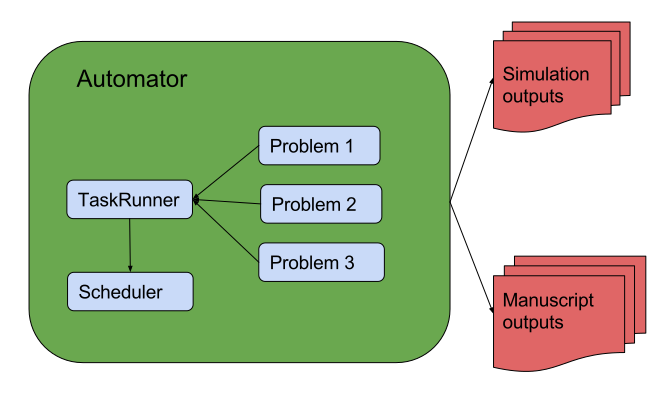
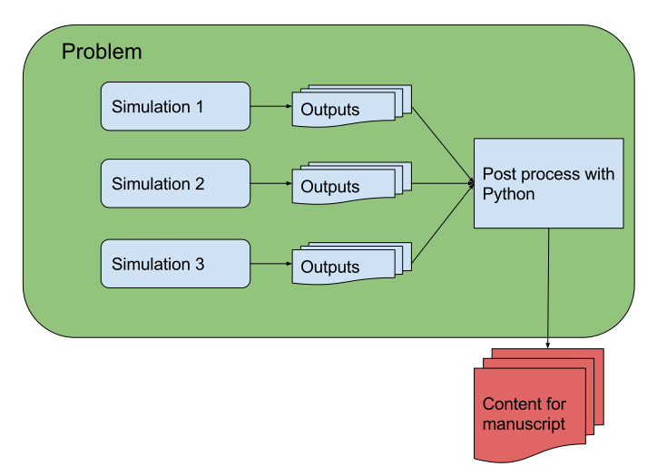

---
jupyter:
  jupytext:
    text_representation:
      extension: .md
      format_name: markdown
      format_version: '1.3'
      jupytext_version: 1.14.5
  kernelspec:
    display_name: Python 3 (ipykernel)
    language: python
    name: python3
---

<!-- #region slideshow={"slide_type": "slide"} -->
# Getting started with automan

<br/>
<br/>

**Prabhu Ramachandran and Pawan Negi**
<br/>

**SciPy 2024**

<!-- #endregion -->

<!-- #region slideshow={"slide_type": "slide"} -->
## Installation

- Install via `pip install automan`
- We use numpy and matplotlib for our examples
- `git clone https://github.com/prabhuramachandran/automan-scipy2024.git`
  - Slides in the `slides` folder
  - Examples in `code`

<!-- #endregion -->

<!-- #region slideshow={"slide_type": "slide"} -->
## A toy example

- Trivial example that computes the powers of the integers
- Supports command line arguments

<!-- #endregion -->

<!-- #region slideshow={"slide_type": "slide"} -->
## Best usage recommendations

Your programs should:

1. be configurable using command line arguments

2. generate output files in directory specified on command line

3. save post-processed data into a file

<!-- #endregion -->

<!-- #region slideshow={"slide_type": "slide"} -->
## `code/powers.py`
<!-- #endregion -->

```python
%load ../code/powers.py
```


<!-- #region slideshow={"slide_type": "slide"} -->
## Explore the code

- Run the example
- Look at the output


<!-- #endregion -->

<!-- #region slideshow={"slide_type": "slide"} -->
## Exercise

- Generate the cube of integers from 0 to 10
- Plot the results in the generated `results.npz`

<!-- #endregion -->
```python
%matplotlib inline
```

```python
# Your solution here.
```

<!-- #region slideshow={"slide_type": "slide"} -->
## Solution

<!-- #endregion -->

```python
import numpy as np
import matplotlib.pyplot as plt
data = np.load('../code/results.npz')
plt.plot(data['x'], data['y'])
plt.savefig('x_cube.png')
```

<!-- #region slideshow={"slide_type": "slide"} -->
## Automation requirements

- Run ``powers.py`` with different arguments
- Schedule all the simulations and complete them
- Output: single plot comparing all the results

<!-- #endregion -->


<!-- #region slideshow={"slide_type": "slide"} -->
## Using automan: the workflow

- Write an `automate.py` (can be any Python file)
- Specify the Problems (simulations and post-processing)
- Run:

```bash
$ python automate.py
```
- Wait and do other work

```bash
$ cd manuscript; mklatex paper.tex -pdf
```

- Optionally add hardware resources

<!-- #endregion -->

<!-- #region slideshow={"slide_type": "slide"} -->
## Design overview
<center>

</center>
<!-- #endregion -->

<!-- #region slideshow={"slide_type": "slide"} -->
## The basic idea

- Simulation directory: simulation output (`outputs`)
- Output directory: `manuscript/figures`

<br/>

- Break up simulations into `Problem`s
- Each `Problem` may require many simulations

<!-- #endregion -->

<!-- #region slideshow={"slide_type": "slide"} -->
<center>

</center>
<!-- #endregion -->

<!-- #region slideshow={"slide_type": "slide"} -->
## The simplest automation

<!-- #endregion -->

```python
%load ../code/automate0.py
```
<!-- #region slideshow={"slide_type": "slide"} -->
## Note the following

1. The `Automator` instance and its arguments
1. The `setup` method and `self.cases`
1. `Simulation` instances 
1. Use of `$output_dir`: automatically determined
1. `self.simulation_path(*args)`: output directory of simulation
<!-- #endregion -->

<!-- #region slideshow={"slide_type": "slide"} -->
## Simulation instances

- Manage the parameters
- Allow filtering of cases
- Specify number of cores/threads
- Convert kwarg to command line arguments
- Render kwarg in plots and produce labels

<!-- #endregion -->

<!-- #region slideshow={"slide_type": "slide"} -->
## Simulation examples

<!-- #endregion -->

```python
from automan.api import Simulation
s = Simulation(root='test', base_command='test -d $output_dir', arg_one=1, arg2='b')
```
```python
s.name
```
```python
s.command
```
```python
s.params
```
```python
s.input_path('results.npz')
```

```python
s.render_parameter('arg1')
```

<!-- #region slideshow={"slide_type": "slide"} -->
## Running the simulations

- Run the simulations if needed

```bash
$ python automate0.py
```
<!-- #endregion -->


<!-- #region slideshow={"slide_type": "slide"} -->
## Exercise: make some plots

- Start with the `automate0.py`
- Modify it to produce a plot in the `run` method
- Hints:
  1. Use `Simulation.input_path` to locate the files in simulation output (`results.npz`)
  2. Use `self.output_path(*arg)` to output files in manuscript output folder

<!-- #endregion -->

<!-- #region slideshow={"slide_type": "slide"} -->
## Re-running post-processing

- If you re-run 

```bash
$ python automate0.py
```

- Nothing will happen!

- You can delete older plots and redo them with:

```bash
$ python automate0.py -f
```

- This will not delete the simulation files

<!-- #endregion -->


<!-- #region slideshow={"slide_type": "slide"} -->
## Solution
<!-- #endregion -->

```python
%load ../code/automate1.py
```

<!-- #region slideshow={"slide_type": "slide"} -->
## Exercise: more simulations

- Start with the previous solution: `automate1.py`
- Modify it to produce output for $x^1, x^2, x^3, x^4, x^5$

<!-- #endregion -->


<!-- #region slideshow={"slide_type": "slide"} -->
## Solution
<!-- #endregion -->

```python
%load ../code/automate1.py
```

<!-- #region slideshow={"slide_type": "slide"} -->
## Observations

- Automan will not re-run already completed cases
- Automatically runs all the other cases
- Need to use `-f` as the output was already produced earlier
- Assumption is that post-processing is generally quick
<!-- #endregion -->

<!-- #region slideshow={"slide_type": "slide"} -->
## Summary of workflow

- Break up requirements into `Problem`s
- Each `Problem` can have many `Simulation`s (in `self.cases`)
- Use the convenience methods of `Simulation` to generalize the plots
- Automan manages the rest

<!-- #endregion -->
